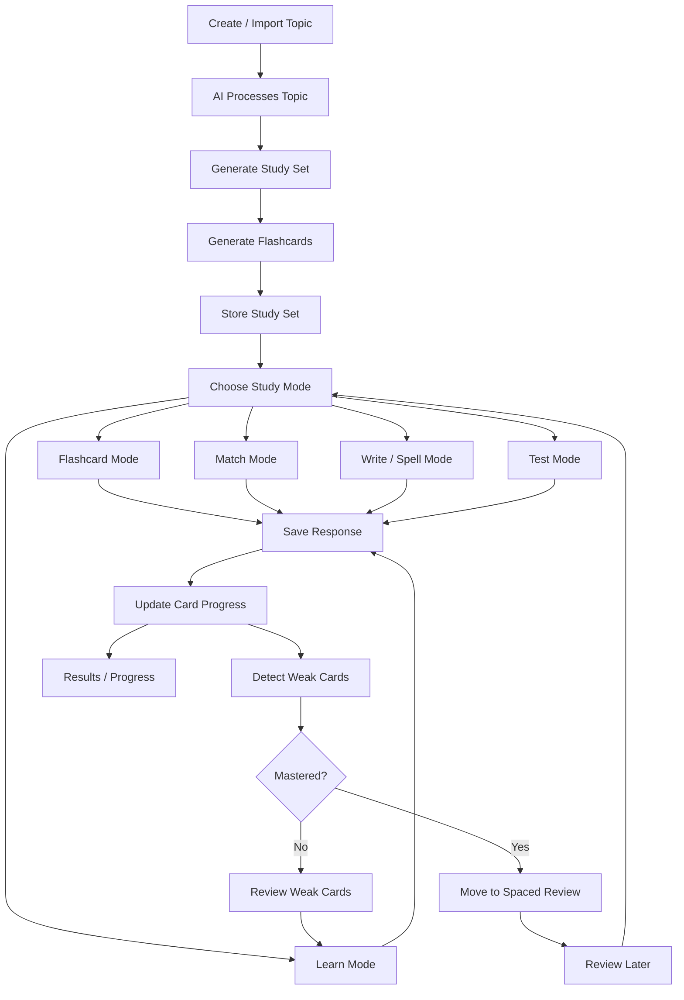
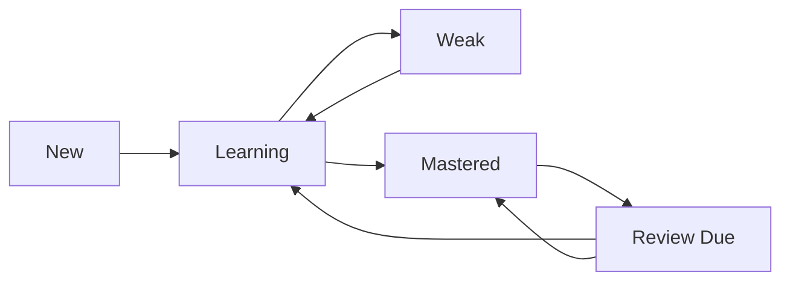

# NETS Flashcard Study Engine Documentation

## 1. Purpose

The goal is to build a **Quizlet-style flashcard study engine** inside NETS, but adapted for our own homework system.

This feature is focused only on flashcards and study modes:

```text
Create topic → Generate flashcards → Study → Practice → Test → Review weak cards → Review later
```

This documentation explains:

- what we should use from Quizlet-style mechanics
- why each mechanic is useful
- where it fits in our NETS system
- when it should appear in the student flow
- what we should build first
- what we should skip for now

This is **not** about anti-cheat, language QA, Boss Fight, or security. This is only the flashcard learning engine.

---

## 2. Main Product Idea

Quizlet is successful because it is not only “cards on a screen.” It is a full study loop:

```text
Card creation → Active recall → Practice modes → Weak item repetition → Test mode → Spaced review → Progress tracking
```

NETS should use the same learning logic, but inside our own product flow.

Our system should become:

```text
AI-generated study set + interactive study modes + progress memory + weak-card review
```

The main goal is:

```text
Help students remember information, not just read it once.
```

---

## 3. What We Use From Quizlet and Why

| Quizlet-style mechanic | Use in NETS? | Why we use it |
|---|---:|---|
| Flashcard flip mode | Yes | Basic active recall. Student tries to remember before seeing the answer. |
| Learn Mode | Yes | Adaptive practice. Weak cards appear more often. |
| Test Mode | Yes | Final self-check from the same study set. |
| Match Mode | Yes | Good for term-definition, word-meaning, formula-name, event-date pairs. |
| Spell / Write Mode | Yes | Useful for vocabulary, scientific terms, formulas, and exact spelling. |
| Spaced repetition | Yes | Brings cards back later so students remember long-term. |
| Weak card tracking | Yes | System knows what the student does not know yet. |
| Star / save difficult cards | Yes, as “weak/saved cards” | Lets students focus on hard cards. |
| Progress dashboard | Yes | Shows mastered, weak, learning, and review-due cards. |
| Magic Notes-style AI generation | Yes | AI converts topic/textbook content into flashcards quickly. |
| Q-Chat-style card explanation | Later | Useful as “Explain this card” or “Give me an example.” Not first version. |
| Diagram cards | Later | Useful for biology, geography, chemistry, history maps. Build after core cards. |
| Gravity-style arcade game | Later / optional | Fun typing game, but not required for first version. |
| Quizlet Live / social classroom mode | Later / optional | Good for classroom, but not core individual study. |
| Leaderboards / public competition | Skip first | Can distract from learning and adds complexity. |

---

## 4. What We Should Not Copy

We should not copy Quizlet exactly. We should adapt the learning mechanics only.

Skip for first version:

```text
Exact Quizlet UI/branding
Public study set marketplace
Social sharing
Quizlet Live clone
Leaderboards
Heavy streak system
Notifications
PDF/CSV export
Advanced classroom dashboard
Full Gravity arcade clone
```

Reason:

The first goal is to make a strong study engine. Social, classroom, and arcade features can come later.

---

## 5. NETS Flashcard Flow



---

## 6. Step-by-Step System Explanation

## Step 1 — Create / Import Topic

### What

The student or teacher starts with a topic.

Examples:

- Photosynthesis
- Present Perfect tense
- Silk Road
- Algebra formulas
- Periodic table
- Human digestive system

The source can be:

- textbook topic
- teacher input
- uploaded text
- copied notes
- AI-generated lesson topic

### Where

Frontend:

```text
Study Set Create Page
```

Backend:

```text
POST /study-sets
```

### When

This is the first step before any cards exist.

### Why

Flashcards need a clear parent topic. Without a topic, cards become random and hard to organize.

---

## Step 2 — AI Processes Topic

### What

AI reads the topic or source material and extracts important information.

It should identify:

- key terms
- definitions
- examples
- formulas
- processes
- dates
- people
- cause-effect relations
- vocabulary
- common mistakes

### Where

Backend service:

```text
Flashcard generation service
```

Prompt file:

```text
flashcard_generation_prompt.md
```

### When

After the topic is created or imported.

### Why

Students should spend time studying, not manually formatting cards. AI reduces setup friction.

---

## Step 3 — Generate Study Set

### What

The system creates a parent study set.

Example:

```json
{
  "id": "set_1",
  "title": "Photosynthesis",
  "subject": "Biology",
  "grade": 7,
  "source_type": "topic",
  "card_count": 20,
  "created_at": "2026-05-12T12:00:00Z"
}
```

### Where

Database model:

```text
StudySet
```

### When

Before creating individual cards.

### Why

The study set groups all cards into one collection. This allows students to reopen, review, and track progress by topic.

---

## Step 4 — Generate Flashcards

### What

AI creates cards from the study set topic.

Basic card example:

```json
{
  "id": "card_1",
  "study_set_id": "set_1",
  "front": "What is photosynthesis?",
  "back": "Photosynthesis is the process plants use to make food using sunlight, water, and carbon dioxide.",
  "type": "definition",
  "difficulty": "easy",
  "hint": "Plants use sunlight.",
  "example": "A leaf making glucose.",
  "status": "new"
}
```

### Where

Backend:

```text
FlashcardGenerator
```

Database:

```text
Flashcard
```

### When

Immediately after the study set is created.

### Why

The card is the main learning unit. Everything else uses these cards.

---

## Step 5 — Store Flashcards

### What

The generated cards are saved.

The system stores:

- study set data
- card content
- user progress
- weak cards
- mastered cards
- next review dates

### Where

Database tables/models:

```text
StudySet
Flashcard
FlashcardProgress
ReviewQueueItem
```

### When

After AI generation.

### Why

Students must be able to leave and come back later. Flashcards are not one-time content.

---

## Step 6 — Choose Study Mode

### What

Student chooses how they want to study.

Available modes:

```text
Flashcards
Learn
Match
Write / Spell
Test
Weak Cards Review
```

### Where

Frontend:

```text
Study Set Page
```

### When

After the study set is generated and saved.

### Why

Different learners need different practice styles. One mode is not enough.

---

# 7. Study Modes

## 7.1 Flashcard Mode

### What

Student sees the front of the card, tries to remember, then flips to see the back.

Flow:

```text
Show front → Student thinks → Flip card → Show answer → Bildim / Bilmadim
```

### Example

```text
Front: What is photosynthesis?
Back: The process plants use to make food using sunlight, water, and carbon dioxide.
```

### Buttons

```text
Bildim = I knew it
Bilmadim = I did not know it
```

### Why

This uses **active recall**. The student must retrieve the answer from memory before seeing it.

### Data saved

```json
{
  "card_id": "card_1",
  "mode": "flashcard",
  "result": "known",
  "confidence": "bildim"
}
```

### Build priority

Must-have in V1.

---

## 7.2 Learn Mode

### What

Adaptive practice mode. The system asks questions based on cards and repeats weak cards more often.

Question types:

```text
Multiple choice
Fill in the blank
Choose correct explanation
Short answer
Fix the mistake
```

### Example

```text
Question: Plants use sunlight to make _____.
Answer: glucose
```

### Why

Flashcard flipping alone can become too passive. Learn Mode forces practice and correction.

### How it adapts

```text
Correct answer → card becomes stronger
Wrong answer → card becomes weak
Repeated wrong answer → card appears again sooner
```

### Build priority

Must-have in V1.

---

## 7.3 Match Mode

### What

Student matches pairs.

Examples:

```text
Photosynthesis → Plants make food
Mitochondria → Releases energy
Evaporation → Liquid becomes gas
```

### Best for

```text
Term → definition
Word → meaning
Formula → name
Event → date
Person → achievement
Object → function
```

### Why

Match Mode builds quick recognition and memory fluency.

### When not to use

Do not use Match Mode for complex reasoning or long explanations.

### Build priority

V2 after Flashcard, Learn, and Test modes.

---

## 7.4 Write / Spell Mode

### What

Student types the answer.

Examples:

```text
Type the word: photosynthesis
Type the formula: H2O
Type the grammar form: have been
Type the date: 1492
```

### Best for

```text
English vocabulary
Scientific terms
Formulas
Names
Dates
Symbols
Spelling
```

### Why

Typing strengthens memory through active production. It is stronger than simply recognizing the answer.

### Build priority

V2.

---

## 7.5 Test Mode

### What

The system generates a test from the same study set.

Question types:

```text
Multiple choice
True / false
Fill blank
Matching
Short written answer
```

### Example

```json
{
  "question": "What is the main purpose of photosynthesis?",
  "type": "multiple_choice",
  "options": [
    "To make food",
    "To move water",
    "To create soil",
    "To break rocks"
  ],
  "answer": "To make food"
}
```

### Why

Testing is not only assessment. It is also a learning method. When students test themselves, memory becomes stronger.

### Build priority

Must-have in V1.

---

## 7.6 Weak Cards Review

### What

This mode only shows cards the student struggled with.

A card becomes weak if:

```text
Student marks Bilmadim
Student answers wrong
Student skips card
Student needs many attempts
Student forgets it repeatedly
```

### Why

Students should not waste all time on cards they already know. Weak-card review makes study efficient.

### Build priority

Must-have in V1.

---

## 7.7 Spaced Review

### What

Cards return later based on how well the student knows them.

Example schedule:

| Card strength | Next review |
|---|---|
| Weak | Same session |
| Learning | Tomorrow |
| Mastered | 3 days later |
| Strong | 7 days later |

### Why

This supports long-term memory. Reviewing later is better than cramming once.

### Build priority

V2 or V3, after progress tracking works.

---

# 8. Card Types

The system should not create only term-definition cards. Different topics need different card types.

| Card type | Example | Best for |
|---|---|---|
| Definition | What is photosynthesis? | Biology, history, vocabulary |
| Q/A | Why did the Silk Road matter? | General subjects |
| Formula | Area of circle = ? | Math, physics |
| Process | Put digestion steps in order | Biology, chemistry |
| Example | Which sentence uses Present Perfect? | English, grammar |
| Mistake | What is wrong in this answer? | Math, grammar, science |
| Diagram | Label the leaf part | Biology, geography |
| Date/Event | 1991 → Uzbekistan independence | History |
| Person/Achievement | Al-Khwarizmi → Algebra | History, science |
| Vocabulary | Word → meaning | English, Uzbek, Russian |

---

# 9. Card Lifecycle



## Status meanings

| Status | Meaning |
|---|---|
| new | Student has not studied this card yet |
| learning | Student has started practicing |
| weak | Student got it wrong or marked Bilmadim |
| mastered | Student answered correctly multiple times |
| review_due | Card should return later |

---

# 10. Progress Tracking

Every study action should save response data.

## Study response example

```json
{
  "card_id": "card_1",
  "study_set_id": "set_1",
  "mode": "learn",
  "correct": true,
  "attempt_number": 1,
  "time_ms": 4200,
  "confidence": "medium",
  "created_at": "2026-05-12T12:00:00Z"
}
```

## Card progress example

```json
{
  "card_id": "card_1",
  "status": "learning",
  "correct_count": 2,
  "wrong_count": 1,
  "last_seen_at": "2026-05-12T12:00:00Z",
  "next_review_at": "2026-05-13T12:00:00Z"
}
```

### Why

Without progress tracking, the system cannot know what to repeat or what to mark as mastered.

---

# 11. Mastery Rules

## Simple V1 mastery logic

```text
If correct_count >= 2 and wrong_count == 0 → mastered
If wrong_count > 0 → learning or weak
If Bilmadim → weak
If skipped → weak
```

## Better later logic

```text
Mastery = accuracy + confidence + review history + time since last review
```

### Why

Mastery should mean the student remembers the card more than once, not just clicked correctly one time.

---

# 12. Adaptation Rules

The system should choose the next cards based on progress.

| Situation | System action |
|---|---|
| New card | Show in Flashcard or Learn Mode |
| Correct once | Keep in learning |
| Correct multiple times | Move toward mastered |
| Wrong answer | Mark weak and repeat soon |
| Bilmadim | Mark weak |
| Mastered | Move to review queue |
| Review due | Show again later |

---

# 13. Results Screen

At the end of a session, show clear progress.

Example:

```json
{
  "study_set_id": "set_1",
  "studied": 20,
  "mastered": 12,
  "weak": 5,
  "learning": 3,
  "accuracy": 80,
  "next_action": "Review weak cards"
}
```

## Results UI should show

```text
Cards studied
Cards mastered
Weak cards
Accuracy
Review due cards
Recommended next step
```

### Why

Students need to know what improved and what to do next.

---

# 14. Required Backend Models

## StudySet

```json
{
  "id": "set_1",
  "title": "Photosynthesis",
  "subject": "Biology",
  "grade": 7,
  "source_type": "topic",
  "created_by": "user_1",
  "card_count": 20,
  "created_at": "2026-05-12T12:00:00Z"
}
```

## Flashcard

```json
{
  "id": "card_1",
  "study_set_id": "set_1",
  "front": "What is photosynthesis?",
  "back": "Plants make food using sunlight, water, and carbon dioxide.",
  "type": "definition",
  "difficulty": "easy",
  "hint": "Plants use sunlight.",
  "example": "A leaf making glucose.",
  "order": 1
}
```

## FlashcardProgress

```json
{
  "id": "progress_1",
  "user_id": "user_1",
  "card_id": "card_1",
  "status": "learning",
  "correct_count": 2,
  "wrong_count": 1,
  "last_seen_at": "2026-05-12T12:00:00Z",
  "next_review_at": "2026-05-13T12:00:00Z"
}
```

## StudySession

```json
{
  "id": "session_1",
  "study_set_id": "set_1",
  "user_id": "user_1",
  "mode": "learn",
  "started_at": "2026-05-12T12:00:00Z",
  "completed_at": null
}
```

## StudyResponse

```json
{
  "id": "response_1",
  "session_id": "session_1",
  "card_id": "card_1",
  "correct": true,
  "attempt_number": 1,
  "time_ms": 4200,
  "confidence": "medium"
}
```

## ReviewQueueItem

```json
{
  "id": "review_1",
  "user_id": "user_1",
  "card_id": "card_1",
  "due_at": "2026-05-15T12:00:00Z",
  "strength": "mastered"
}
```

---

# 15. Required API Endpoints

```text
POST /study-sets
GET /study-sets/:id
POST /study-sets/:id/generate-cards
GET /study-sets/:id/cards
POST /study-sessions
POST /study-responses
GET /study-sets/:id/progress
GET /study-sets/:id/weak-cards
GET /review-queue
POST /review-queue/:id/complete
```

## Endpoint purpose

| Endpoint | Purpose |
|---|---|
| POST /study-sets | Create a study set |
| GET /study-sets/:id | Open a study set |
| POST /study-sets/:id/generate-cards | Generate AI flashcards |
| GET /study-sets/:id/cards | Load cards |
| POST /study-sessions | Start a study mode session |
| POST /study-responses | Save answer/progress |
| GET /study-sets/:id/progress | Show results |
| GET /study-sets/:id/weak-cards | Review weak cards |
| GET /review-queue | Get due review cards |
| POST /review-queue/:id/complete | Mark review completed |

---

# 16. Required Frontend Screens

```text
Study Set Create Page
Study Set Detail Page
Flashcard Mode Page
Learn Mode Page
Match Mode Page
Write / Spell Mode Page
Test Mode Page
Weak Cards Review Page
Results Page
Review Queue Page
```

---

# 17. UI Flow Per Screen

## Study Set Detail Page

Shows:

```text
Title
Subject
Grade
Total cards
Mastered count
Weak count
Study mode buttons
```

## Flashcard Mode Page

Shows:

```text
Card front
Flip animation
Card back
Bildim / Bilmadim buttons
Progress count
```

## Learn Mode Page

Shows:

```text
Question
Answer input/options
Submit button
Feedback
Next question
```

## Match Mode Page

Shows:

```text
Term cards
Definition cards
Timer
Matched pairs
Score
```

## Write / Spell Mode Page

Shows:

```text
Prompt
Typing input
Hint button
Submit button
Correct spelling feedback
```

## Test Mode Page

Shows:

```text
Mixed questions
Progress bar
Submit test
Final score
Missed cards review
```

## Results Page

Shows:

```text
Studied cards
Mastered cards
Weak cards
Accuracy
Next suggested mode
Review due information
```

---

# 18. Implementation Plan

## Phase 1 — Foundation

```text
1. Audit current flashcard files
2. Add StudySet schema/model
3. Add Flashcard schema/model
4. Add FlashcardProgress model
5. Add AI flashcard generation service
6. Add basic API endpoints
```

## Phase 2 — Core Study Mode

```text
7. Build Flashcard Mode UI
8. Add flip card interaction
9. Add Bildim / Bilmadim buttons
10. Save progress after each card
11. Show basic results
```

## Phase 3 — Practice Engine

```text
12. Build Learn Mode
13. Add multiple choice and fill-blank questions
14. Add weak-card detection
15. Add Weak Cards Review page
16. Add mastery logic
```

## Phase 4 — Test Mode

```text
17. Generate test questions from flashcards
18. Build Test Mode UI
19. Save test responses
20. Show score and missed cards
```

## Phase 5 — Game Modes

```text
21. Build Match Mode
22. Build Write / Spell Mode
23. Add timer and score only where useful
24. Save progress from game modes
```

## Phase 6 — Long-Term Review

```text
25. Add spaced review queue
26. Add review_due card status
27. Add Review Queue page
28. Add next_review_at calculation
```

## Phase 7 — Polish and Tests

```text
29. Add loading states
30. Add empty states
31. Add mobile layout
32. Add tests
33. Run full build/test
```

---

# 19. Testing Plan

## Backend tests

```text
Study set creation works
AI generated cards validate schema
Cards save correctly
Progress updates after response
Weak cards are detected
Mastery status updates
Review queue schedules cards
Test mode generates from cards
```

## Frontend tests

```text
Flashcard flips correctly
Bildim/Bilmadim buttons save progress
Learn Mode shows feedback
Match Mode matches pairs
Write Mode checks typed answer
Test Mode submits answers
Results screen shows correct counts
```

## Manual tests

```text
Create Biology study set
Generate 20 cards
Study 5 cards in Flashcard Mode
Mark 2 as Bilmadim
Open Weak Cards Review
Confirm weak cards appear
Complete Learn Mode
Open Results
Confirm mastered/weak counts update
```

---

# 20. Version Scope

## V1 Must-Have

```text
Study set creation
AI card generation
Flashcard Mode
Bildim / Bilmadim
Progress tracking
Learn Mode
Weak Cards Review
Test Mode
Results screen
```

## V2 Add

```text
Match Mode
Write / Spell Mode
Spaced Review Queue
Better analytics
Card difficulty levels
Hints and examples
```

## V3 Add

```text
Diagram cards
Audio cards
Q-Chat style explain-card assistant
Classroom mode
Notifications
Import/export
Advanced review scheduling
```

---

# 21. Final Recommended Flow for NETS

```text
Create / Import Topic
→ AI Generates Study Set
→ AI Generates Flashcards
→ Student Opens Study Set
→ Student Studies Flashcards
→ Student Practices in Learn Mode
→ System Detects Weak Cards
→ Student Reviews Weak Cards
→ Student Takes Test Mode
→ System Shows Results
→ Mastered Cards Move to Spaced Review
→ Student Returns Later
```

---

# 22. Final Reasoning

We use Quizlet-inspired mechanics because they solve the main problem of studying:

```text
Students forget information when they only read it once.
```

The flashcard engine fixes this by using:

| Learning need | System answer |
|---|---|
| Student needs to remember | Flashcard Mode |
| Student needs practice | Learn Mode |
| Student needs quick recognition | Match Mode |
| Student needs exact spelling/formula | Write / Spell Mode |
| Student needs self-check | Test Mode |
| Student forgets some cards | Weak Cards Review |
| Student needs long-term memory | Spaced Review Queue |
| Student needs feedback | Results Screen |

The system should not be only a card viewer. It should be a study cycle:

```text
Recall → Practice → Correct → Repeat → Test → Review Later
```

That is the core of the NETS Flashcard Study Engine.
